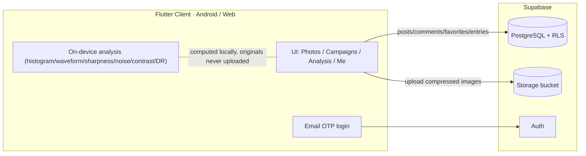

# PhotoMaster

> A private-circle photo-sharing app with **on-device image quality analysis**. One Flutter codebase for Android / Web, backed by Supabase.

English | [简体中文](README.md)

PhotoMaster is a photo-sharing app for a small circle of friends, with a built-in image-quality analysis module that runs **entirely on-device (originals are never uploaded)** — histograms, waveform, sharpness, noise, contrast, dynamic range, EXIF — plus an **A/B objective comparison** tool.

## ✨ Features

- **Photo sharing**: post photo sets (caption / #tags / location / auto EXIF) → a feed timeline + personal page; editable, deletable, favoritable, commentable.
- **Text posts**: six categories (gear / tips / Q&A / post-processing / presets / shooting spots), separate from photo sharing.
- **Themed campaigns**: WeChat-article style — a 1:1 poster + title; open to read rules and submit; entries can be liked, edited and deleted.
- **On-device image analysis**: luma/RGB histograms, luma waveform, sharpness (Laplacian variance + Tenengrad), noise (Immerkær estimate), RMS contrast, effective dynamic range, color temperature, plus an overall score; every metric ships with thresholds and a plain-language explanation; analysis image can be saved/shared.
- **A/B comparison**: compare two samples metric-by-metric and auto-pick the winner.
- **Email OTP login**: identity bound to email, recoverable across devices/reinstalls.
- **More**: daily drift-bottle intro, comment notifications, IP region, in-app update prompt, multiple color themes, built-in manual.

## 🧩 Tech Stack

- **Frontend**: Flutter / Dart, Riverpod (state), go_router (routing), `image` / `exif` (on-device processing), cached_network_image
- **Backend**: Supabase (Auth + PostgreSQL + Storage, Row Level Security)
- **Deploy**: Web → Netlify; Android → signed APK

## 🏗️ Architecture



## 🔬 On-device Image Quality Algorithms

Everything runs locally; images are never uploaded:

| Metric | Method |
|---|---|
| Sharpness | Laplacian variance, Tenengrad (Sobel gradient energy) |
| Noise | Immerkær noise estimation (fixed convolution kernel) |
| Contrast | RMS contrast (std of luma) |
| Dynamic range | span between the 0.5% and 99.5% luma percentiles, in stops |
| Exposure | highlight-clipping / shadow-crushing ratios, mean brightness |
| Color | gray-world color temperature approximation |
| Waveform/Histogram | luma + RGB distributions, luma waveform |

## 🚀 Quick Start

### Requirements
- Flutter 3.44+ (Dart 3.12+)
- A Supabase project (free tier is enough)

### Set up your own Supabase

Each user runs their **own** Supabase; data is fully isolated.

1. **Create a project** at [supabase.com](https://supabase.com/) → *New project*.
2. **Initialize the database**: open **SQL Editor**, paste the full contents of [`supabase/schema.sql`](supabase/schema.sql) and **Run** (creates tables, RLS policies, functions, triggers, and the `post-images` storage bucket; safe to re-run).
3. **Enable email OTP login**: *Authentication → Providers → Email* (allow sign-ups); in *Email Templates*, add the code variable `{{ .Token }}` to the **Magic Link** and **Confirm signup** templates, e.g.:
   ```html
   <h2>Your login code</h2>
   <p style="font-size:28px;font-weight:bold;letter-spacing:4px;">{{ .Token }}</p>
   ```
   (Optional but recommended: configure custom SMTP under *SMTP Settings*, otherwise the built-in mailer is heavily rate-limited.)
4. **Get credentials** from *Project Settings → API*: copy **Project URL** and the **anon / publishable key** (never use `service_role`).
5. **Write local config** (kept out of git):
   ```bash
   cp env/supabase.json.example env/supabase.json
   ```
   ```jsonc
   {
     "SUPABASE_URL": "https://<your-project-ref>.supabase.co",
     "SUPABASE_PUBLISHABLE_KEY": "<your-publishable-key>"
   }
   ```
   > `env/supabase.json` is gitignored — your credentials stay local and are never committed.

### Run
```bash
flutter pub get
flutter run --dart-define-from-file=env/supabase.json
```

### Build
```bash
# Web (add --no-web-resources-cdn to avoid loading CanvasKit from Google's CDN)
flutter build web --release --no-web-resources-cdn --dart-define-from-file=env/supabase.json

# Android APK
flutter build apk --release --dart-define-from-file=env/supabase.json
```

> ⚠️ **Security**: the `service_role` key bypasses RLS and must only be used server-side — never ship it in the client or commit it. The client only uses the `publishable/anon` key.

## 📁 Project Layout

```
lib/
  app/           # entry, routing, theme
  core/          # Supabase client, shared widgets
  features/
    auth/        # email OTP login
    photography/ # photo posts / timeline / composer / search
    text_post/   # text posts
    campaign/    # themed submission campaigns
    lab/         # on-device image analysis + A/B comparison
    social/      # favorites / comments / action bar (shared)
    profile/     # personal page / profile
    notifications/ update/ drift_bottle/ ...
supabase/schema.sql   # database schema & RLS (run it in your Supabase)
```

## 📄 License

MIT License — see [LICENSE](LICENSE).
