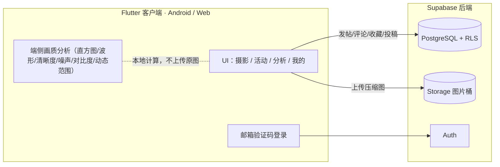

# PhotoMaster

> 小圈子影像分享 + 端侧画质分析工具。基于 Flutter 一套代码跨 Android / Web，后端用 Supabase。

PhotoMaster 是一个面向好友小圈子的摄影分享应用，并内置**完全在本地运行、不上传原图**的画质分析模块（直方图 / 波形 / 清晰度 / 噪声 / 对比度 / 动态范围 / EXIF），以及**竞品 A/B 客观对比**。

## ✨ 功能特性

- **摄影分享**：发图帖（文案 / #标签 / 地址 / 自动 EXIF）→ 朋友圈式时间线 + 个人主页；可编辑、删除、收藏、评论。
- **文字帖**：器材 / 技巧 / 提问 / 后期 / 预设 / 机位 六类，与图片分享隔离。
- **主题投稿活动**：像公众号推送——1:1 海报 + 标题；进入看规则、投稿，作品可点赞、可改删。
- **端侧画质分析**：本地计算亮度/RGB 直方图、亮度波形、清晰度（拉普拉斯方差 + Tenengrad）、噪声（Immerkær 估计）、RMS 对比度、有效动态范围、色温，并综合评分；每项指标带阈值与原理解读；可保存/分享分析图。
- **竞品 A/B 对比**：两张样张逐项客观对比并自动判优。
- **邮箱验证码登录**：身份绑定邮箱，换设备/重装可找回。
- **其他**：漂流瓶每日开场、评论通知、IP 属地、应用内新版本提示、多套配色主题、使用说明。

## 📸 截图

> 把截图放到 `docs/screenshots/` 下并替换下面链接。

| 时间线 | 画质分析 | 竞品对比 |
|---|---|---|
|  |  |  |

## 🧩 技术栈

- **前端**：Flutter / Dart，Riverpod（状态）、go_router（路由）、`image` / `exif`（端侧图像处理）、cached_network_image
- **后端**：Supabase（Auth + PostgreSQL + Storage，行级安全 RLS）
- **部署**：Web → Netlify；Android → 签名 APK

## 🏗️ 架构



## 🔬 端侧画质分析算法

全部在设备本地完成，不上传图片：

| 指标 | 方法 |
|---|---|
| 清晰度 | 拉普拉斯方差、Tenengrad（Sobel 梯度能量）|
| 噪声 | Immerkær 噪声估计（特定卷积核）|
| 对比度 | RMS 对比度（亮度标准差）|
| 动态范围 | 亮度 0.5%~99.5% 分位跨度换算成档(stops) |
| 曝光 | 高光溢出 / 暗部死黑占比、平均亮度 |
| 色彩 | 灰世界近似色温 |
| 波形/直方图 | Luma + RGB 分布、亮度波形 |

## 🚀 快速开始

### 环境要求
- Flutter 3.44+（Dart 3.12+）
- 一个 Supabase 项目（免费额度即可）

### 1) 配置后端
在 [Supabase](https://supabase.com/) 新建项目，然后：
- 打开 **SQL Editor**，粘贴并运行 [`supabase/schema.sql`](supabase/schema.sql)（建表 + RLS + 函数/触发器）。
- **Authentication → Providers → Email** 打开，并把邮件模板加入 `{{ .Token }}`（验证码登录用）。

### 2) 配置凭据（不入库）
复制示例并填入你自己的项目地址与 publishable/anon key：
```bash
cp env/supabase.json.example env/supabase.json
```
```jsonc
{
  "SUPABASE_URL": "https://your-project-ref.supabase.co",
  "SUPABASE_PUBLISHABLE_KEY": "your-publishable-key"
}
```
> `env/supabase.json` 已在 `.gitignore` 中，不会被提交。

### 3) 运行
```bash
flutter pub get
flutter run --dart-define-from-file=env/supabase.json
```

### 4) 构建
```bash
# Web（中国网络下加 --no-web-resources-cdn 避免 CanvasKit 从 Google CDN 加载）
flutter build web --release --no-web-resources-cdn --dart-define-from-file=env/supabase.json

# Android APK
flutter build apk --release --dart-define-from-file=env/supabase.json
```

## 📁 目录结构

```
lib/
  app/           # 应用入口、路由、主题
  core/          # Supabase 客户端、通用组件
  features/
    auth/        # 邮箱验证码登录
    photography/ # 摄影帖 / 时间线 / 发帖 / 搜索
    text_post/   # 文字帖
    campaign/    # 主题投稿活动
    lab/         # 端侧画质分析 + 竞品对比
    social/      # 收藏 / 评论 / 操作条（通用）
    profile/     # 个人主页 / 资料
    notifications/ update/ drift_bottle/ ...
supabase/schema.sql   # 数据库结构与 RLS（自行在 Supabase 运行）
```

## 📄 许可证

本项目采用 MIT License，详见 [LICENSE](LICENSE)。
